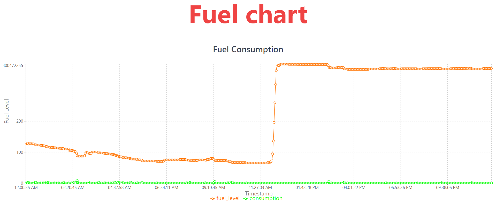

# Fuel Consumption Chart

This project displays a fuel consumption chart over time using `Recharts` in React. It visualizes fuel level data and consumption over a given timestamp in a line graph format, featuring a clean UI with responsive design. The chart includes smooth transitions and tooltips for enhanced user interaction.

## Screenshot

## Technologies Used
- React.js
- Recharts
- CSS for styling

## How to Run
1. Clone the repository.
2. Install dependencies: `npm install`.
3. Start the app: `npm start`.
4. View the chart on `http://localhost:3000`.
